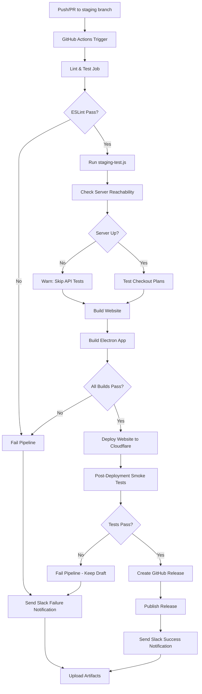
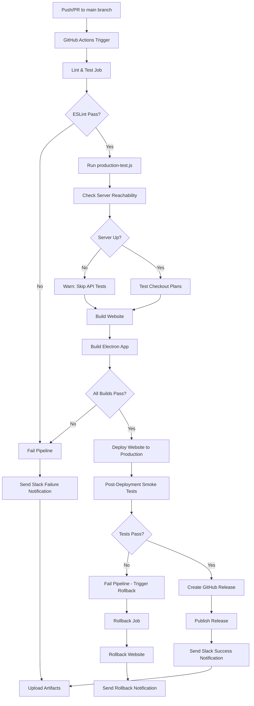

# RinaWarp Terminal Pro - CI/CD Pipelines

## Staging Pipeline

### Pipeline Flow Diagram



### Pipeline Stages

#### 1. Trigger & Setup
- **Trigger**: Push or PR to `staging` branch
- **Environment**: Node.js 20 with npm caching
- **Dependencies**: `npm ci` for all projects

#### 2. Validation Phase
- **ESLint**: Code quality checks (max warnings = 0)
- **Server Check**: `staging.rinawarptech.com` reachability (5s timeout)
- **API Tests**: Checkout validation for all plans (if server reachable)

#### 3. Build Phase
- **Website**: `apps/website` - `npm run build`
- **Electron**: `apps/terminal-pro/desktop` - `npm run build`

#### 4. Deployment Phase
- **Website**: `wrangler deploy --env staging`
- **Electron**: GitHub Release (draft → published after validation)

#### 5. Validation Phase
- **Smoke Tests**:
  - Website accessibility
  - API health endpoint
  - Basic functionality checks

#### 6. Notification & Logging
- **Success**: Slack notification + published release
- **Failure**: Slack alert + draft release kept unpublished
- **Artifacts**: Full logs, builds, configs (always uploaded)

### Safety Features

- ✅ **Graceful Network Handling**: API tests skipped if server unreachable
- ✅ **Draft Releases**: Electron releases stay draft until validation passes
- ✅ **Post-Deploy Validation**: Smoke tests ensure deployment success
- ✅ **Comprehensive Logging**: All artifacts preserved for debugging
- ✅ **Scoped Secrets**: Staging-only credentials and tokens

### Required Secrets

```bash
# GitHub Repository Secrets
CLOUDFLARE_API_TOKEN     # For wrangler deployments
GITHUB_TOKEN            # For release creation (auto-provided)
SLACK_WEBHOOK_URL       # For notifications (hardcoded in workflow)
```

### Local Testing

```bash
# Run full staging validation locally
node staging-test.js

# For DNS testing, add to /etc/hosts:
# 123.45.67.89 staging.rinawarptech.com
```

### Monitoring

- **Slack Channel**: Real-time success/failure notifications
- **GitHub Actions**: Pipeline status and logs
- **Artifacts**: Run-numbered logs for every execution
- **Releases**: Timestamped staging releases with build artifacts

### Future Enhancements

- Parallel build jobs for faster execution
- Enhanced smoke tests (checkout flows, auth validation)
- Automatic rollback on deployment failures
- Extended artifact retention (30+ days)

## Production Pipeline

### Pipeline Flow Diagram



### Key Differences from Staging

- **Trigger Branch**: `main` branch instead of `staging`
- **Environment**: Production environment (`NODE_ENV=production`)
- **Domains**: Live domains (`www.rinawarptech.com`, `api.rinawarptech.com`)
- **Rollback Capabilities**: Automatic rollback job on deployment failure
- **Release Publishing**: Releases published immediately (not draft)
- **Validation**: Uses `production-test.js` for live domain testing

### Pipeline Stages

#### 1. Trigger & Setup
- **Trigger**: Push or PR to `main` branch
- **Environment**: Node.js 20 with npm caching, `NODE_ENV=production`
- **Dependencies**: `npm ci` for all projects

#### 2. Validation Phase
- **ESLint**: Code quality checks (max warnings = 0)
- **Server Check**: `www.rinawarptech.com` reachability (5s timeout)
- **API Tests**: Checkout validation for all plans (if server reachable)

#### 3. Build Phase
- **Website**: `apps/website` - `npm run build`
- **Electron**: `apps/terminal-pro/desktop` - `npm run build`

#### 4. Deployment Phase
- **Website**: `wrangler deploy --env production`
- **Electron**: GitHub Release (published immediately after validation)

#### 5. Validation Phase
- **Smoke Tests**:
  - Website accessibility
  - API health endpoint
  - Basic functionality checks

#### 6. Rollback (on Failure)
- **Automatic Rollback**: Website deployment rolled back via Cloudflare
- **Notification**: Slack alert for rollback action

#### 7. Notification & Logging
- **Success**: Slack notification + published release
- **Failure**: Slack alert + automatic rollback
- **Artifacts**: Full logs, builds, configs (always uploaded)

### Safety Features

- ✅ **Graceful Network Handling**: API tests skipped if server unreachable
- ✅ **Automatic Rollback**: Production deployments rolled back on failure
- ✅ **Post-Deploy Validation**: Smoke tests ensure deployment success
- ✅ **Comprehensive Logging**: All artifacts preserved for debugging
- ✅ **Production Secrets**: Live environment credentials and tokens

### Required Secrets

```bash
# GitHub Repository Secrets
CLOUDFLARE_API_TOKEN      # For wrangler deployments and rollbacks
CLOUDFLARE_ACCOUNT_ID     # Cloudflare account identifier
GITHUB_TOKEN             # For release creation (auto-provided)
SLACK_WEBHOOK_URL        # For notifications (hardcoded in workflow)
```

### Validation Steps

```bash
# Run full production validation locally
node production-test.js

# Test production domains directly:
# - Website: https://www.rinawarptech.com
# - API: https://api.rinawarptech.com/api/health
# - Checkout: https://api.rinawarptech.com/api/checkout-v2
```

### Monitoring

- **Slack Channel**: Real-time success/failure/rollback notifications
- **GitHub Actions**: Pipeline status and logs
- **Artifacts**: Run-numbered logs for every execution
- **Releases**: Timestamped production releases with build artifacts
- **Cloudflare**: Deployment history and rollback logs